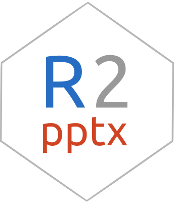

<!-- README.md is generated from README.Rmd. Please edit that file -->

```{r, include = FALSE}
knitr::opts_chunk$set(
  collapse = TRUE,
  comment = "#>",
  fig.path = "man/figures/README-",
  out.width = "100%"
)
```


# r2pptx  

<!-- badges: start -->
<!-- badges: end -->

# Overview 

`r2pptx` leverages the power of the `officer` package and the ease of use of powerpoint
templates, making it simple to create powerpoint slide decks straight from R.

[Documentation is available online](https://mattle24.github.io/r2pptx/) or through the vignettes. 

## Installation

``` r
install.packages("r2pptx")

# to get the development version from GitHub:
remotes::install_github("mattle24/r2pptx")
```

# Contributing

If you think you have encountered a bug, please [submit an issue](https://github.com/mattle24/r2pptx/issues). Please include a minimal, reproducible
example when you submit an issue. The [reprex package](https://reprex.tidyverse.org/articles/articles/learn-reprex.html) provides a fantastic interface for creating these kinds of examples, and has great documentation on how to make them.

If you would like to contribute code, correct a type, or add documentation, please [open a pull request](https://github.com/mattle24/r2pptx/pulls).

We have a [Contributor Code of Conduct]. By participating in `r2pptx` you agree to abide by its terms.

# Thank you

Thank you to [David Gohel](https://github.com/davidgohel) for the [`officeverse`](https://ardata-fr.github.io/officeverse/) packages! `r2pptx` is a wrapper
around David's excellent work.

Also thank you to Hadley Wickham and Jenny Bryan for an [introduction to S4 in Advanced R](https://adv-r.hadley.nz/s4.html) and [a guide to package developmemt](https://r-pkgs.org/index.html)!
